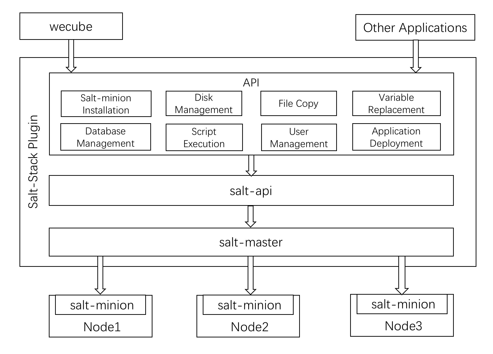

# SaltStack Plugin

[](https://opensource.org/licenses/Apache-2.0)

 
English / [中文](README_CN.md)

## Introduction

Salt is a new approach to infrastructure management built on a dynamic communication bus. Salt can be used for data-driven orchestration, remote execution for any infrastructure, configuration management for any app stack, etc.

The SaltStack plugin encapsulates and packages the salt-api according to the specific needs of different scenarios, which reduces the difficulty of using SaltStack. It also provides an API interface that is closer to the business usage scenarios.

As an essential member of the WeCube plugin group, the SaltStack plugin provides WeCube with the ability to manage infrastructure resources. In the meanwhile, the SaltStack plugin can also offer pluggable services for third-party applications.

SaltStack plugin 1.0.0 is now released, its architecture & APIs are as follows:

 

## Key Features

The SaltStack plugin relies on services such as `salt-master`, `salt-api`, and `httpd`. Based on these services, it encapsulates a layer of APIs for system management and application deployment.

User can perform the following operations through the APIs provided by the plugin:

- Salt-minion installation: After the host installs the salt-minion, all subsequent operations on the host can be triggered from the salt-master;
- File copy: Download files from the S3 server and deploy them to the specified directory of the specified host. If there is a compressed package, it also provides decompression capability;
- Variable replacement: Replace variables in the configuration files of installation package and send the new package to S3 server;
- Script execution: User can choose a host to execute bash or python scripts which are stored in the local or S3 server;
- User management: You can create or remove user on a specified host;
- Database management: Excute the sql file stored in S3 server on a specified mysql database instance;
- Disk management: Check whether a specified host has an unformatted data disk. Format the data disk on the specified host and set it as automatically mounted in a host directory;
- Application deployment: Download the application installation package from the specified S3 server and excute the corresponding script to start or stop the application.

## How to build development environment

Please refer to the [SaltStack Plugin Development Guide](docs/compile/wecube-plugins-saltstack_build_dev_env_en.md) on how to build development environment.

## Build and Run Docker Image

Before executing the following command, please make sure docker command is installed on the CentOS host. Click here to know [How to Install Docker](https://docs.docker.com/install/linux/docker-ce/centos/).

1. Git clone source code 

```shell script
git clone https://github.com/WeBankPartners/wecube-plugins-saltstack.git
```


2. Build plugin binary

```shell script
make build 
```


3. Build plugin docker image, the docker image tag is github's commit number.

```shell script
make image
```


4. Run plugin container. Please replace variable `{$HOST_IP}` with your host ip, replace variable `{$IMAGE_TAG}` with your image tag, and execute the following command.  
| port | comment                          |
| ---- | ----------------------------- |
| 9099 | salt-minion install port     |
| 4505 | salt-master pub port       |
| 4506 | salt-master ret port |
| 4507 | salt plugin instances connect port     |
```shell script
docker run -d  --restart=unless-stopped -v /etc/localtime:/etc/localtime -e minion_master_ip={$HOST_IP} -e minion_port=22 -p 9099:80 -p 9090:8080 -p 4505:4505 -p 4506:4506 -p 8082:8082 --privileged=true  -v /home/app/data/minions_pki:/etc/salt/pki/master/minions -v /home/app/wecube-plugins-saltstack/logs:/home/app/wecube-plugins-saltstack/logs -v /home/app/data:/home/app/data wecube-plugins-saltstack:{$TAG_NUM}
```

5. after running the SaltStack Plugin, use the following curl command to check if SaltStack plugin works fine. 

```shell script
curl -X POST  http://127.0.0.1:8082/v1/deploy/agent/install -H "cache-control: no-cache"  -H "content-type: application/json" -d "{\"inputs\":[{\"guid\":\"1234\",\"seed\":\"abc12345\",\"host\":\"10.0.0.14\",\"password\": \"251f54c3f5be75e171ae1eb516dbacd9\"}]}"
```

salt-minion has been installed on host：`10.0.0.14` when you saw the message below:

```json
{
    "resultCode": "0",
    "resultMessage": "success",
    "results": {
        "outputs": [
            {
                "guid": "1234"
            }
        ]
    }
}
```

## Build Plugin Package for Wecube

If you want to build a plugin package to work with Wecube, please execute the following command. You can replace variable `{$package_version}` with the version number you want.

```shell script
make package PLUGIN_VERSION=v{$package_version}
```


Read more in [Build SaltStack Plugin Docker Image Guide](docs/compile/wecube-plugins-saltstack_compile_guide_en.md).

## API Reference

Please refer to the [SaltStack API Guide](docs/api/wecube_plugins_saltstack_api_guide_en.md)

## License

SaltStack Plugin is licensed under the Apache License Version 2.0, please refer to the [license](http://www.apache.org/licenses/LICENSE-2.0) for details.


## Community

- For quick response, please [open an issue](https://github.com/WeBankPartners/wecube-plugins-saltstack/issues/new/choose) to us, or you can also scan the following QR code to join our community, we will provide feedback as quickly as we can.

  <div align="left">
  
  </div>

- Contact us: fintech@webank.com
