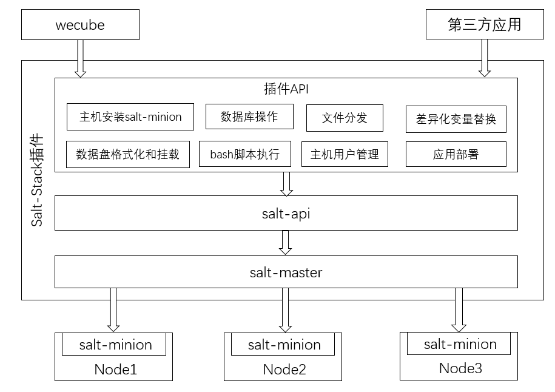

# SaltStack插件
[](https://opensource.org/licenses/Apache-2.0)

 
中文 / [English](README_EN.md)

## 简介
SaltStack插件包含salt-master,salt-api和httpd等服务，基于这些服务封装了一层对主机进行系统管理和应用部署的API。用户可通过该插件提供的API执行如下操作:
- salt-minion安装：主机安装salt-minion后,后续所有对该主机的操作都可从salt-master发起
- 文件分发：从S3对象存储中下载文件并部署到指定主机的指定目录，如果是压缩包还提供解压能力
- 变量替换操作：将安装包指定目录下的配置文件进行变量替换，并重新生成替换后的安装包放到S3对象存储
- 脚本执行：可指定用户在指定主机上执行主机本地或者S3对象存储上的bash和python脚本。
- 用户管理操作：可在指定主机上新增用户、删除用户；
- 数据库操作：在指定的mysql数据库实例上执行S3对象存储上的sql文件
- 数据盘操作：检查指定主机是否有未格式化的数据盘；可对指定主机上的数据盘进行格式化并设置自动挂在到某个主机目录
- 应用部署：可指定主机下发S3上对象存储上的应用安装包，并执行安装包内的指定脚本用来启动或者停止应用




## 插件开发环境搭建
[Salt-Stack插件开发环境搭建指引](docs/compile/wecube-plugins-saltstack_build_dev_env.md)

**注意**:Salt-Stack插件编译完毕后，运行二进制前必须确认本机已安装salt-master、salt-api、mysql client等组件，建议在linux主机上使用docker镜像的方式运行Salt-Stack插件，因为docker镜像中已默认安装salt-api等组件。


## 插件docker镜像和插件包制作
[Salt-Stack插件docker镜像包和插件包制作指引](docs/compile/wecube-plugins-saltstack_compile_guide.md)

## 运行插件
执行如下命令运行Salt-Stack插件容器,其中变量HOST_IP需要替换为容器所在主机ip，该ip在执行主机安装salt-minion时使用，变量TAG_NUM对应代码最后一次提交的commit号;另外因为该插件运行需要占用主机9090、4505、4606和8082四个端口，请使用netstat或者ss命令确认这4个端口未被其他程序占用。

```
docker run -d  --restart=unless-stopped -v /etc/localtime:/etc/localtime -e minion_master_ip={$HOST_IP} -e minion_passwd=Ab888888 -e minion_port=22 -p 9099:80 -p 9090:8080 -p 4505:4505 -p 4506:4506 -p 8082:8082 --privileged=true  -v /home/app/data/minions_pki:/etc/salt/pki/master/minions -v /home/app/wecube-plugins-saltstack/logs:/home/app/wecube-plugins-saltstack/logs -v /home/app/data:/home/app/data wecube-plugins-saltstack:{$TAG_NUM}
```

**插件日志路径**:/home/app/wecube-plugins-saltstack/logs/wecube-plugins-saltstack.log


使用容器的方式运行插件后,可通过找一台linux主机在其上安装salt-minion来测试。

在Salt-Stack插件所在的机器上运行如下curl命令,其中json参数host为需要安装salt-minion的主机ip,password为加密后的密码，本例中对应的原始密码为qq123456，插件会根据seed和guid生成一个key来解密输入的password获取原始密码。
```
curl -X POST  http://127.0.0.1:8082/v1/deploy/agent/install -H "cache-control: no-cache"  -H "content-type: application/json" -d "{\"inputs\":[{\"guid\":\"1234\",\"seed\":\"abc12345\",\"host\":\"10.0.0.14\",\"password\": \"251f54c3f5be75e171ae1eb516dbacd9\"}]}"
```

如看到如下返回，表示salt-minion安装成功
```
{
    "result_code": "0",
    "result_message": "success",
    "results": {
        "outputs": [
            {
                "guid": "1234"
            }
        ]
    }
}

```

## API使用说明
关于Salt-Stack插件的API说明，请查看以下文档
[SaltStack插件API手册](docs/api/wecube_plugins_saltstack_api_guide.md)

## License
Salt-Stack插件是基于 Apache License 2.0 协议

## 社区
- 如果您想得到最快的响应，请给我们提[Issue](https://github.com/WeBankPartners/wecube-plugin-saltstack/issues/new/choose)或扫描下面的二维码，我们会第一时间反馈。

	<div align="left">
	
	</div>


- 联系我们：fintech@webank.com
