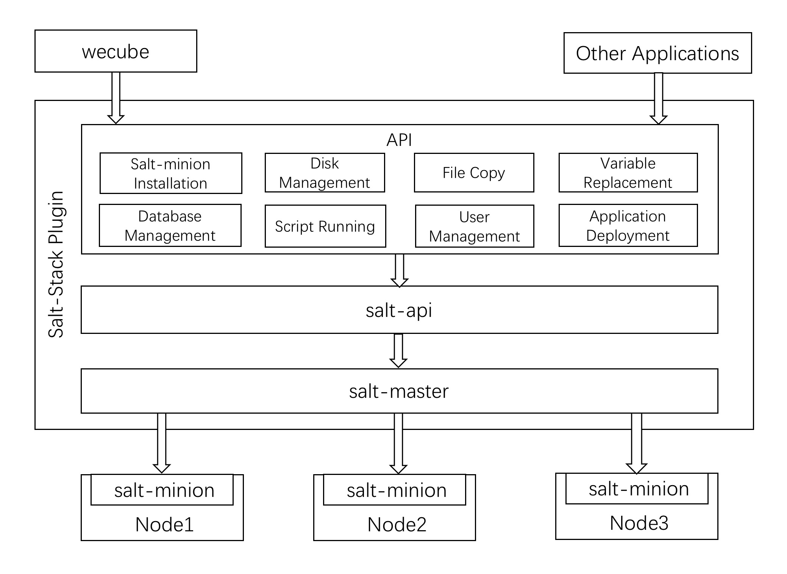
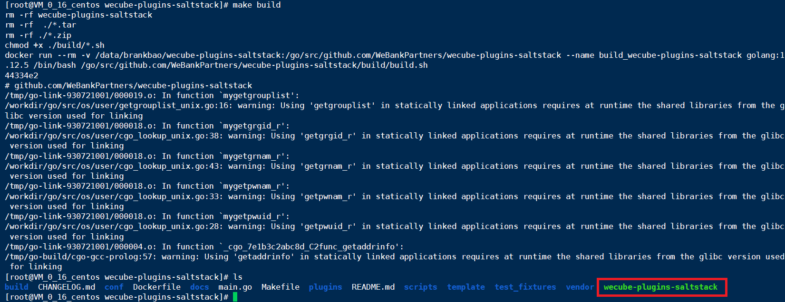
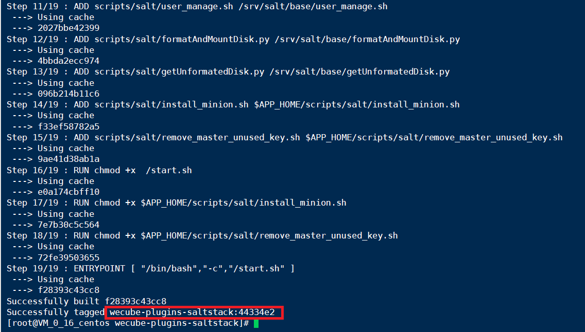
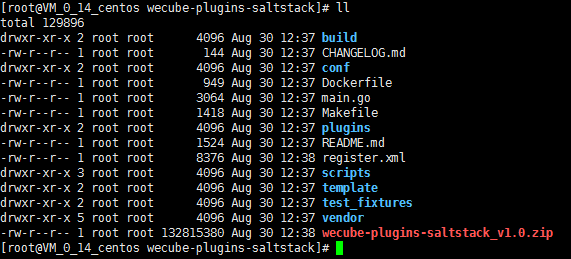

# SaltStack Plugin
[](https://opensource.org/licenses/Apache-2.0)

 
[中文](README.md) / English

## Introduction


SaltStack plugin 1.0.0 is now released, its architecture & APIs is as follows:
 

## How to build development environment
Please refer to the [SaltStack Plugin Development Guide](docs/compile/wecube-plugins-saltstack_build_dev_env_en.md) on how to build development environment.

## Build and Run Docker Image

Before execute the following command, please make sure docker command is installed on the centos host. Click here to know [How to Install Docker](https://docs.docker.com/install/linux/docker-ce/centos/)

1. Git clone source code 

```
git clone https://github.com/WeBankPartners/wecube-plugins-saltstack.git
```


2. Build plugin binary

```
make build 
```



3. Build plugin docker image, the docker image tag is github's commit number.

```
make image
```



4. Run plugin container. Please replace variable {$HOST_IP} with your host ip, replace variable {$IMAGE_TAG} with your image tag, and execute the following command.

```
docker run -d  --restart=unless-stopped -v /etc/localtime:/etc/localtime -e minion_master_ip={$HOST_IP} -e minion_passwd=Ab888888 -e minion_port=22 -p 9099:80 -p 9090:8080 -p 4505:4505 -p 4506:4506 -p 8082:8082 --privileged=true  -v /home/app/data/minions_pki:/etc/salt/pki/master/minions -v /home/app/wecube-plugins-saltstack/logs:/home/app/wecube-plugins-saltstack/logs -v /home/app/data:/home/app/data wecube-plugins-saltstack:{$TAG_NUM}
```
5. after running the SaltStack Plugin， use the following curl command to check if SaltStack plugin works fine. 

```
curl -X POST  http://127.0.0.1:8082/v1/deploy/agent/install -H "cache-control: no-cache"  -H "content-type: application/json" -d "{\"inputs\":[{\"guid\":\"1234\",\"seed\":\"abc12345\",\"host\":\"10.0.0.14\",\"password\": \"251f54c3f5be75e171ae1eb516dbacd9\"}]}"
```

salt-minion has been installed on host：10.0.0.14 when you saw the message below:

```
{
    "result_code": "0",
    "result_message": "success",
    "results": {
        "outputs": [
            {
                "guid": "1234"
            }
        ]
    }
}

```


## Build Plugin Package for Wecube

If you want to build a plugin package to work with Wecube,please execute the following command. You can replace variable {$package_version} with the version number you want.

```
make package PLUGIN_VERSION=v{$package_version}
```




## License
SaltStack Plugin is licensed under the Apache License Version 2.0 , please refer to the [license](LICENSE) for details.


## Community
- For quick response, please [raise an issue](https://github.com/WeBankPartners/wecube-plugins-saltstack/issues/new/choose) to us, or you can also scan the following QR code to join our community, we will provide feedback as quickly as we can.

  <div align="left">
  
  </div>

- Contact us: fintech@webank.com
