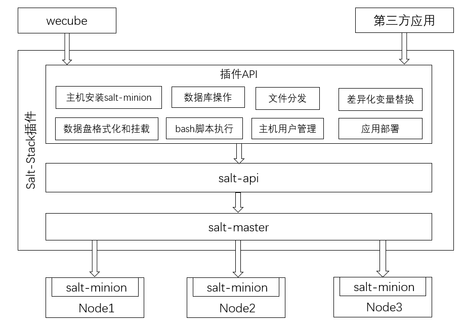

# SaltStack Plugin

[](https://opensource.org/licenses/Apache-2.0)


English / [中文](README.md)

## Introduction
SaltStack is a server infrastructure centralized management platform with configuration management, remote execution, monitoring and other functions. SaltStack is based on the Python and combines the construction of lightweight message level (ZeroMQ) with Python third-party modules (Pyzmq, PyCrypto, Pyjinjia2, python-msgpack and PyYAML).

The SaltStack plugin encapsulates and packages the salt-api according to the specific needs of different scenarios, which reduces the difficulty of using SaltStack and provides API interfaces those are closer to the business usage scenarios.

As an important member of the WeCube plugin group, the SaltStack plugin provides WeCube with the ability to manage host clusters. At the same time, the SaltStack plugin can provide pluggable services for third-party applications independently.

## Key Features

The SaltStack plugin relies on services such as salt-master, salt-api, and httpd. Based on these services, it encapsulates a layer of APIs for system management and application deployment.

The user can perform the following operations through the APIs provided by the plugin:

- Salt-minion installation: After the host installs the salt-minion, all subsequent operations of the host can be ordered from the salt-master;
- File distribution: Download files from the S3 server and deploy them to the specified directory of the specified host. If there is a compressed package, it also provides decompression capability;
- Variable replacement: Replace variables in the configuration files of installation package and send the new package to S3 server;
- Script running: User can choose the specified host to exeute bash or python scripts stored in the local or S3 server;
- User management: You can new or remove user on the specified host;
- Database management: Excute the sql file stored in S3 server on the specified mysql database instance;
- Disk management: Check whether the specified host has an unformatted data disk. Format the data disk on the specified host and set it to automatically hang in a host directory;
- Application deployment: Download the application installation package from the specified S3 server and excute the corresponding script to start or stop application.

The architecture and API are shown below.



## Build Development Environment

Read more [Build SaltStack Plugin Development Environment Guide](docs/compile/wecube-plugins-saltstack_build_dev_env_en.md).

**Notice**: After the SaltStack plugin is compiled, you must confirm that the salt-master, salt-api, mysql client and other components are installed on the host before running the binary. It is recommended to run the SaltStack plugin on the Linux host using the docker image, because the docker image has installed salt-api and other components by default.

## Build Docker Image

Read more [Build SaltStack Plugin Docker Image Guide](docs/compile/wecube-plugins-saltstack_compile_guide.md).

## Run SaltStack Plugin

Run the following command to make the SaltStack plugin container running and the variable {$HOST_IP} needs to be replaced with the host ip of the container. The ip is used when the host installs salt-minion. The variable {$TAG_NUM} corresponds to the commit number of last submitted the code.

The plugin operation needs to occupy four ports of the host 9090, 4505, 4606 and 8082. Please use the netstat or ss command to confirm that the four ports are not occupied by other programs.

```
docker run -d  --restart=unless-stopped -v /etc/localtime:/etc/localtime -e minion_master_ip={$HOST_IP} -e minion_passwd=Ab888888 -e minion_port=22 -p 9099:80 -p 9090:8080 -p 4505:4505 -p 4506:4506 -p 8082:8082 --privileged=true  -v /home/app/data/minions_pki:/etc/salt/pki/master/minions -v /home/app/wecube-plugins-saltstack/logs:/home/app/wecube-plugins-saltstack/logs -v /home/app/data:/home/app/data wecube-plugins-saltstack:{$TAG_NUM}
```

**Log Path**: /home/app/wecube-plugins-saltstack/logs/wecube-plugins-saltstack.log

After running the plugin using the container, install salt-minion on another Linux host to test.

Run the following curl command on the host where the SaltStack plugin is deployed. The json parameter "host" is the host ip that needs to install the salt-minion. The password is the encrypted password. In this example, the corresponding original password is "qq123456". The plugin will generate a key according to the seed and guid to decrypt the input password so that get the original password.

```
curl -X POST  http://127.0.0.1:8082/v1/deploy/agent/install -H "cache-control: no-cache"  -H "content-type: application/json" -d "{\"inputs\":[{\"guid\":\"1234\",\"seed\":\"abc12345\",\"host\":\"10.0.0.14\",\"password\": \"251f54c3f5be75e171ae1eb516dbacd9\"}]}"
```

If you see the following return, it means that the salt-minion installation is successful.

```
{
    "resultCode": "0",
    "resultMessage": "success",
    "results": {
        "outputs": [
            {
                "guid": "1234"
            }
        ]
    }
}
```

## API User Guide

Please see the following document [SaltStack Plugin API Guide](docs/api/wecube_plugins_saltstack_api_guide_en.md).

## License

SaltStack plugin is available under the Apache 2 license. Learn more [license](LICENSE).

## Community

- If you want the fastest response, please open an [Issue](https://github.com/WeBankPartners/wecube-plugins-saltstack/issues/new/choose) or scan the QR code below and we will give feedback as soon as possible.

    <div align="left">
	
	</div>

- Contact us: fintech@webank.com