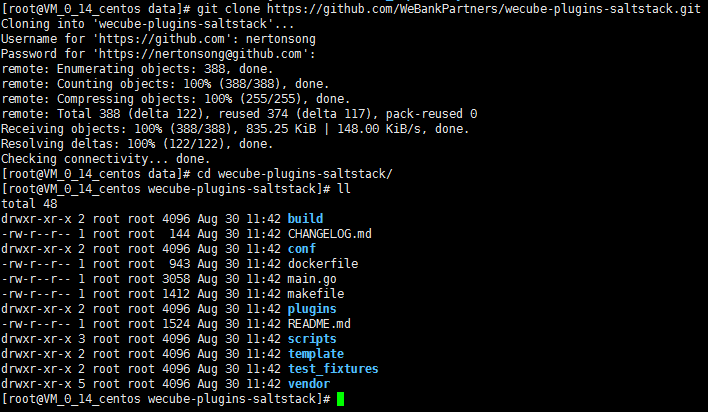
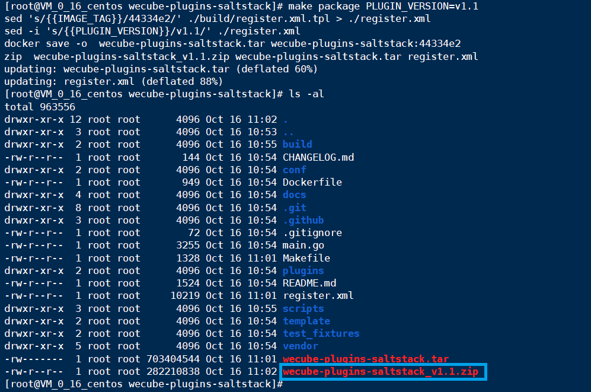

# Salt-Stack Plugin Compile and Package Guide

## Before Compiling

1. Please prepare a linux host. To speed up the compilation, we recommends the host of owning 4 cores 8GB resource configuration;

2. The operating system version is recommended to be ubuntu16.04 higher or centos7.3 higher;

3. The network needs to be able to access the external network (you need to download and install the software from the external network);

4. Git installed
    - Use yum to install
	```
 	yum install -y git
 	```
	- Manual installation, please refer to [git installation documentation](https://github.com/WeBankPartners/we-cmdb/blob/master/cmdb-wiki/docs/install/git_install_guide.md)

5. Installed docker1.17.03.x or higher
    - Please refer to [docker installation documentation](https://github.com/WeBankPartners/we-cmdb/blob/master/cmdb-wiki/docs/install/docker_install_guide.md)

6. Please use netstat or ss command to confirm the host ports 8082, 9090, 4505, 4506 are not occupied.

## Compiling and packaging

1. Pull the code through github

    Switch to the local repository directory and execute the command:

    ```
    cd /data
	git clone https://github.com/WeBankPartners/wecube-plugins-saltstack.git
    ```

    Enter the github account password as prompted, and you can pull the code to the local.

    After that, enter the wecube-plugins-saltstack directory and the structure is as follows:

    \

2. Compile and package the plugin

    - Get plugin binary package.

    ```
	make build
	```
	

    - Generate a docker image.

    ```
	make image
	```
    

    - Make the plugin package.

    ```
	make package PLUGIN_VERSION=v1.0
	```

    The variabloe **PLUGIN_VERSION** is the version number of the plugin package. After the compilation is completed, a zip plugin package will be generated.

    

